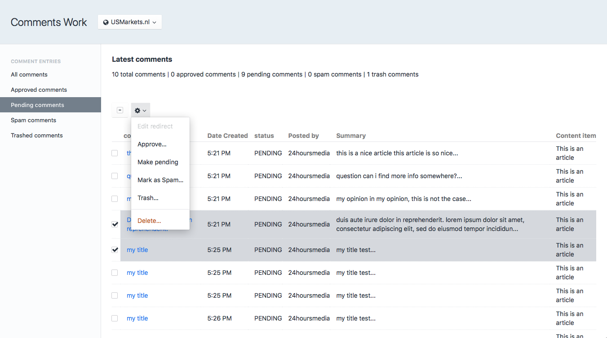

# Comments Work plugin for Craft CMS 3.x

An easy to use and straightforwardc commentin plugin for Craft CMS 3.
Simple and straightforward.

Allow users to post comments to your content, and moderate it from the dashboard.

## Documentation

Read the [quickstart documentation](docs/quickstart.md) to add a form and comments to your page within minutes.

    
    
        <li>{{ comment.title }}</li>
    

## Requirements

This plugin requires Craft CMS 3.0 or later, and works best with the PRO edition.

(Other editions do not support users)

## Installation

To install the plugin, follow these instructions.

1. Open your terminal and go to your Craft project:

        cd /path/to/project

2. Then tell Composer to load the plugin:

        composer require 24hoursmedia-craftcms/comments-work

3. In the Control Panel, go to Settings → Plugins and click the “Install” button for Comments Work.

## Comments Work Overview

- Add user comments to any type of element, such as users and content items
- Get a nice overview of submitted comments in the CP
- Moderation: delete, approve or mark as spam in the CP
- Moderation: modify comment contents in the CP

- Comment forms are signed so malicious users cannot submit comments to arbitrary content

## Configuring Comments Work

There are two configuration options. In the Admin CP, go to 'Settings' -> 'Comments Work'.

- **'auto approve comments'** - if enabled, comments are shown immediately on the site.This bypasses the moderation. NOT RECOMMENDED WHEN ANONYMOUS COMMENTS ARE ENABLED!
- **'Allow anonymous comments'** - allows anonymous users to post comments.

## Using Comments Work

After installation of the plugin, an item 'Comments Work' should appear in the left navigation of the Control Panel.
From here you can moderate submitted comments.

- You can select multiple comments and change their state or delete them
- Click on the comment title to edit the comment's title and comment text

Read the [quickstart documentation](docs/quickstart.md) to add a form and comments to your page within minutes.

    
    
        <li>{{ comment.title }}</li>
    

## Comments Work Roadmap

Potential features:

* Integration with dolphiqForms example/documentation
* Support for multiple formats for entering comments such as MarkDown
* Email notification when new comments are added
* Allow posting to comments only for certain user groups
* Event system so developers can interact with the commenting process
* Support for star ratings plugin integration so users can add ratings
* Ready made bootstrap and jquery integrations

Brought to you by [24hoursmedia](https://www.24hoursmedia.com)
